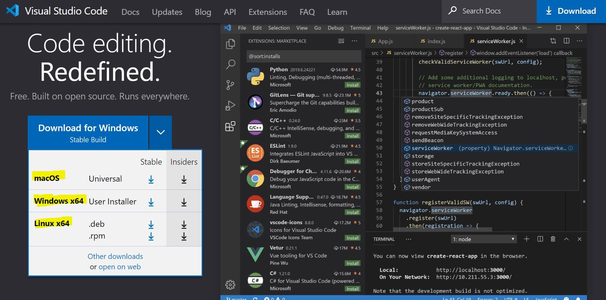
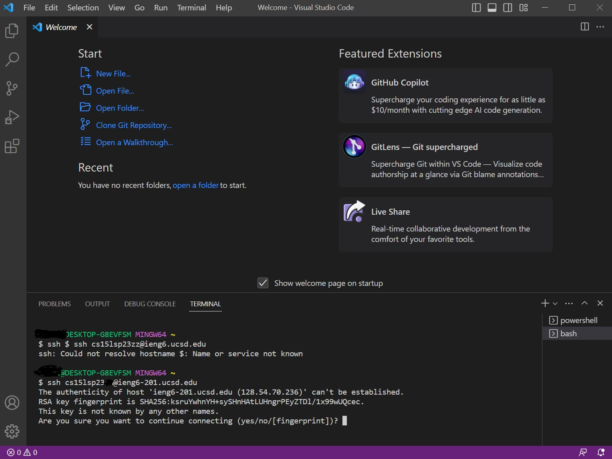
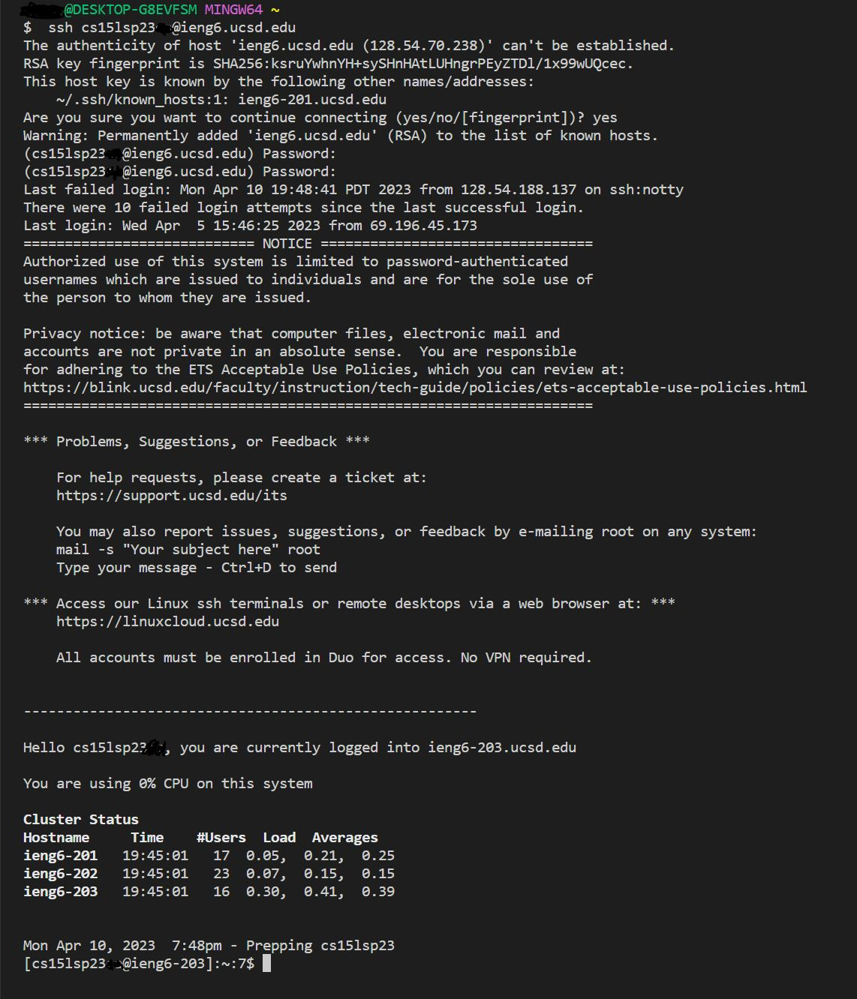
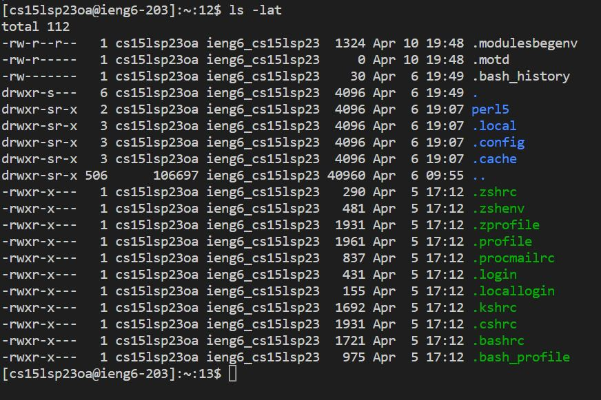

# **Lab One**

**Remote Access and FileSystem**
* Installing VSCode
* Remotely Connecting
* Trying Some Commands

## Installing VSCode
First tep to download and install [**VSCode**](https://code.visualstudio.com/) to your computer.  
You will need to get the version like **macOS** or **Winodws** or **Linux**

## Remotely Connecting
In window you need to get [**git bash**](https://gitforwindows.org/)  
How to use Git in VSCode  
1. Install Gir above
2. In VSCode and Terminal by press and hod **Ctrl** and **`**
3. Open command platette press and hold **Ctrl + Shift + P**
4. Insert - **Select Default Profile**
5. Then select **Git Bash**
6. Later click the + Icon above the Terminal window
7. Now, the terminal will be Git Bash terminal
8. You will see both powershell and bash on the left of terminal window

Then type `**ssh + cs15lsp23(personal two leter)@ieng6-201.ucsd.edu**  `
Now you will see something like this  
  
**Type Yes**  
Then you will see this below  

## Trying Some Commands
There are some commands we can use in the Terminal to try on:  
* `cd`
* `cd ~`  
`cd` is use to swich the current working directory to another given path. During this process the computer will change your directory with a given path.
* `ls -lat`
* `ls -a`
* `ls follow by a directory`
`ls` This is use to print out the folders that is in a given path. This method will help you know what are in which files.
* `cat`
`cat` is use to print the contents of the file that is in your working path. This can help you know what is in your files.
* `cp  `
`cp` it will copy the file in to the path you give or there are two file it will copy one to another.
## **EX :**  

cd in to a path

